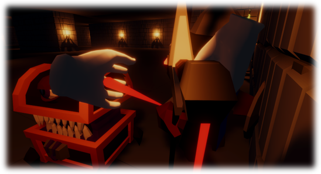
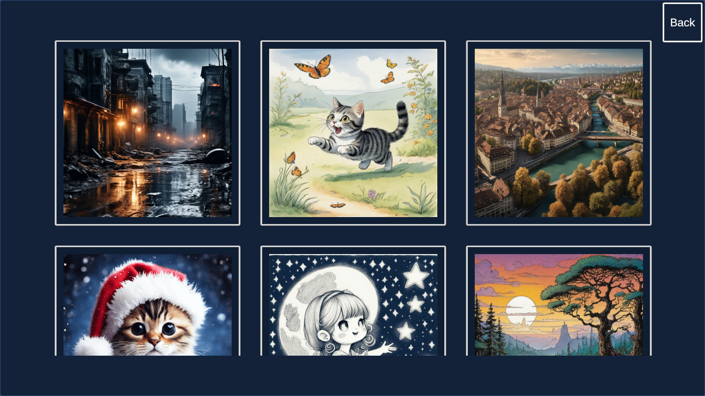
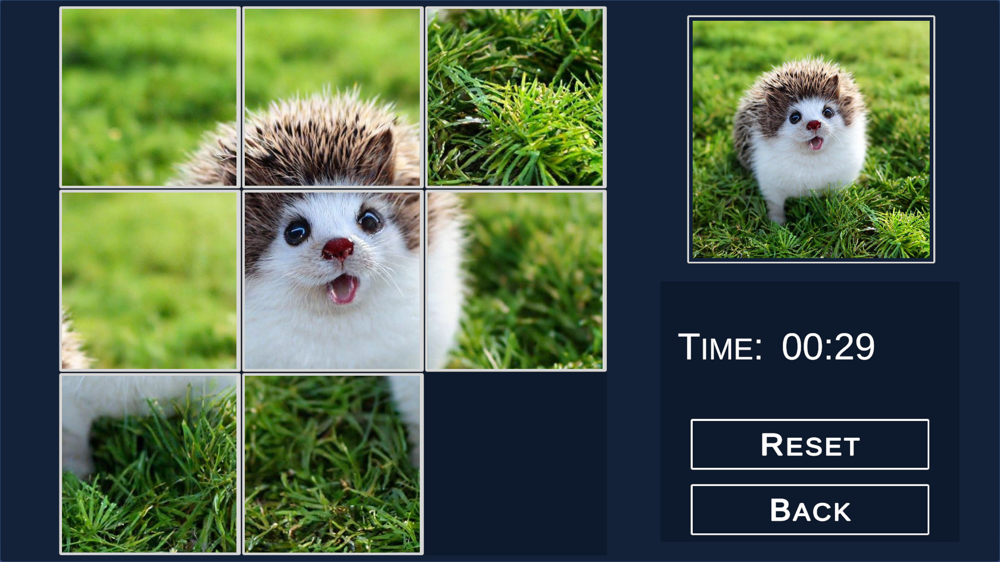
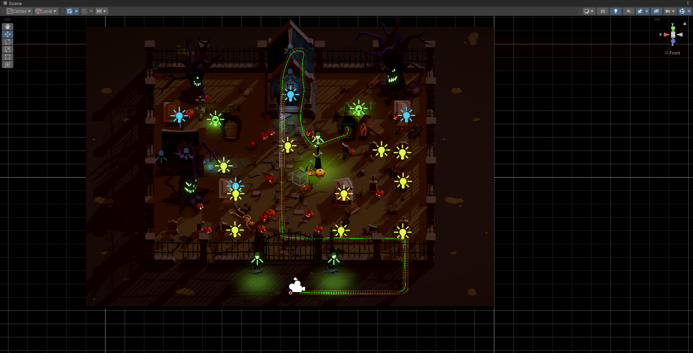
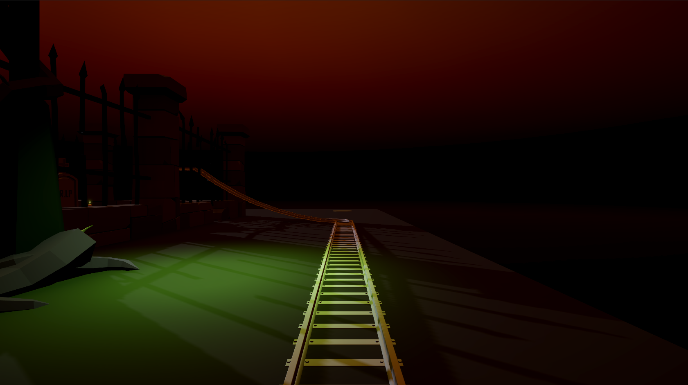
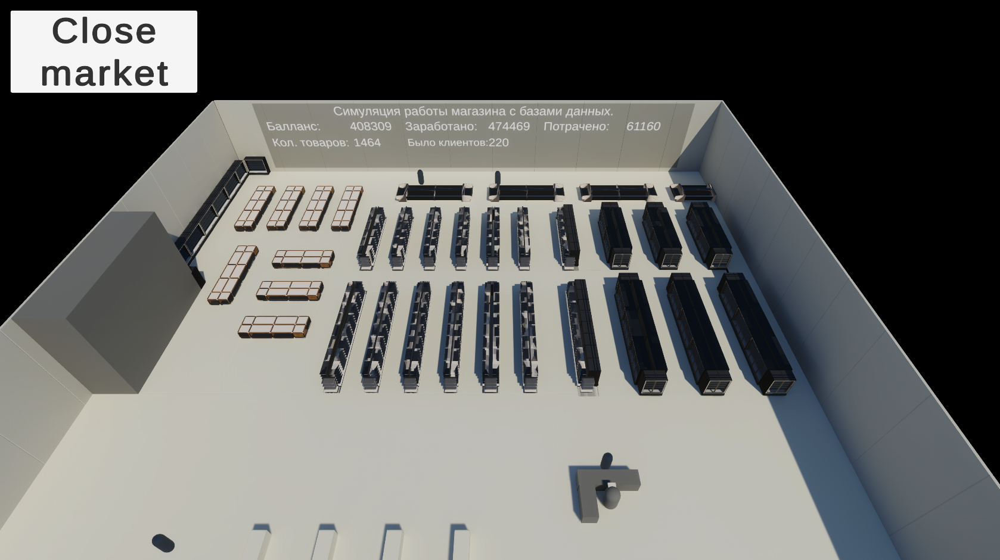

# Unity3D | C# | Portfolio

[English](README.md) | [Русский](README.ru.md)

## Projects

### Endless Dungeon - PC VR

Project link: <https://github.com/ShutovKS/EndlessDungeon>

Endless Dungeon is a VR roguelike with procedurally generated levels. The goal of the game is to progress as far as possible through the dungeon, fighting monsters and upgrading the character. Progression and difficulty mechanics are implemented.

* Itch.io - <https://shutovks.itch.io/endless-dungeon>

### Visual Novel - Between Two Worlds

Project link: <https://github.com/ShutovKS/Between-two-worlds>

A visual novel with a dialogue system, choices, and save/load functionality. The project supports multilingualism and integration with Yandex Games and Yandex Metrica. The game is available on Android, Windows, and WebGL.

* Google Play - <https://play.google.com/store/apps/details?id=com.Forgeofgameworlds.BetweenTwoWorlds>
* RuStore - <https://apps.rustore.ru/app/com.Forgeofgameworlds.BetweenTwoWorlds>
* VK Play - <https://mini.vkplay.ru/play/game/between_two_worlds>
* Itch.io - <https://shutovks.itch.io/between-two-worlds>
* Yandex Game - The game has been removed from publication

### Sliding Puzzle

Project link: <https://github.com/ShutovKS/Sliding-Puzzle>

A game with two modes: assembling a number puzzle and assembling an image. Includes difficulty levels ranging from 2x2 to 9x9.

* Itch.io - <https://shutovks.itch.io/sliding-puzzle>
* Google Play - <https://play.google.com/store/apps/details?id=com.Forgeofgameworlds.SlidingPuzzle>

### Graveyard Roller Coaster

Project link: <https://github.com/ShutovKS/Graveyard-Roller-Coaster>

An educational project for creating a VR attraction where the player rides a roller coaster through a graveyard.

### Builds Manager

Project link: <https://github.com/ShutovKS/Builds-Manager>

A tool for automating builds for various platforms and managing Scripting Define Symbols.

* Unity Asset Store - <https://assetstore.unity.com/packages/tools/utilities/builds-manager-278887>

### Body Motion Capture and Animation in Unity

Project link: <https://github.com/ShutovKS/Body-motion-capture-and-animation-in-Unity>

Using Python and OpenCV for motion capture and transferring data to Unity for character animation.

### Hand Motion Capture and Animation in Unity

Project link: <https://github.com/ShutovKS/Hand-motion-capture-and-animation-in-Unity>

Using Python and OpenCV for hand motion capture and transferring data to Unity for character animation.

### Tic-Tac-Toe - HoloLens 2

Project link: <https://github.com/ShutovKS/Tic-Tac-Toe-in-MR-for-HoloLens-2>

An application for HoloLens 2, demonstrating the capabilities of the Mixed Reality Toolkit (MRTK). The game allows you to play tic-tac-toe in augmented reality using Unity Netcode.

### Store Simulation

Project link: <https://github.com/ShutovKS/Store-Simulation>

A basic store simulation with customers and cash registers. The project is connected to a database for storing items, transactions, and other data.

