# Unity3D | С# | Портфолио

[English](README.md) | [Русский](README.ru.md)

## Проекты

### Бесконечное подземелье - PC VR

Ссылка на проект: <https://github.com/ShutovKS/EndlessDungeon>

Endless Dungeon — это рогалик для VR с процедурной генерацией уровней. Цель игры — пройти как можно дальше по подземелью, сражаясь с монстрами и улучшая персонажа. Реализованы механики прогрессии и усложнения игры.

* Itch.io - <https://shutovks.itch.io/endless-dungeon>

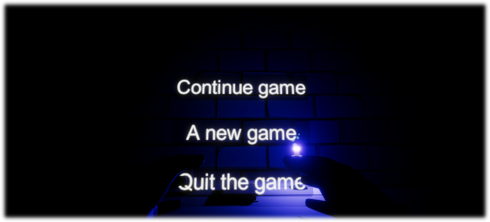
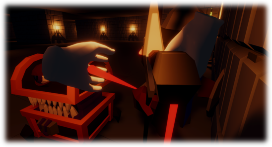

### Визуальная новелла - Между двух миров

Ссылка на проект: <https://github.com/ShutovKS/Between-two-worlds>

Создана визуальная новелла с системой диалогов, выборов и сохранений. Проект поддерживает мультиязычность и интеграцию с Yandex Games и Yandex Metrica. Игра доступна на Android, Windows и WebGL.

* Google Play - <https://play.google.com/store/apps/details?id=com.Forgeofgameworlds.BetweenTwoWorlds>
* RuStore - <https://apps.rustore.ru/app/com.Forgeofgameworlds.BetweenTwoWorlds>
* VK Play - <https://mini.vkplay.ru/play/game/between_two_worlds>
* Itch.io - <https://shutovks.itch.io/between-two-worlds>
* Yandex Game - Игра была снята с публикации

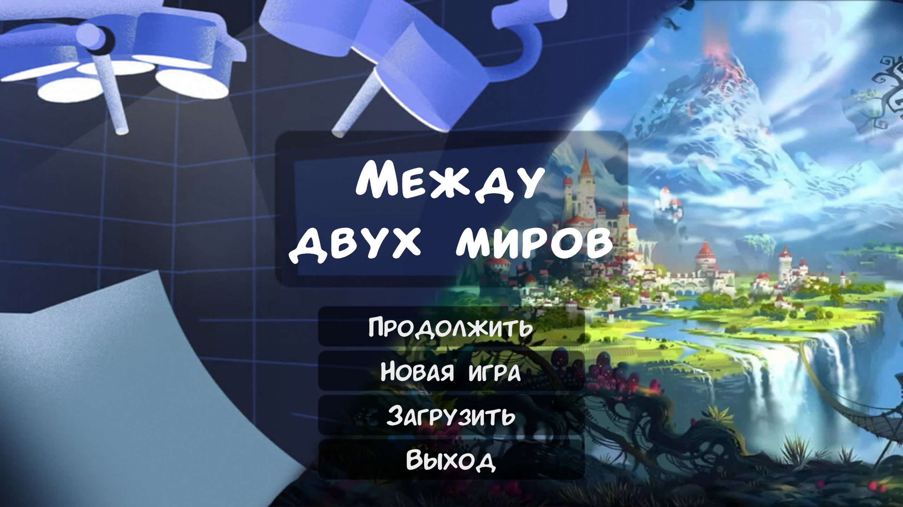
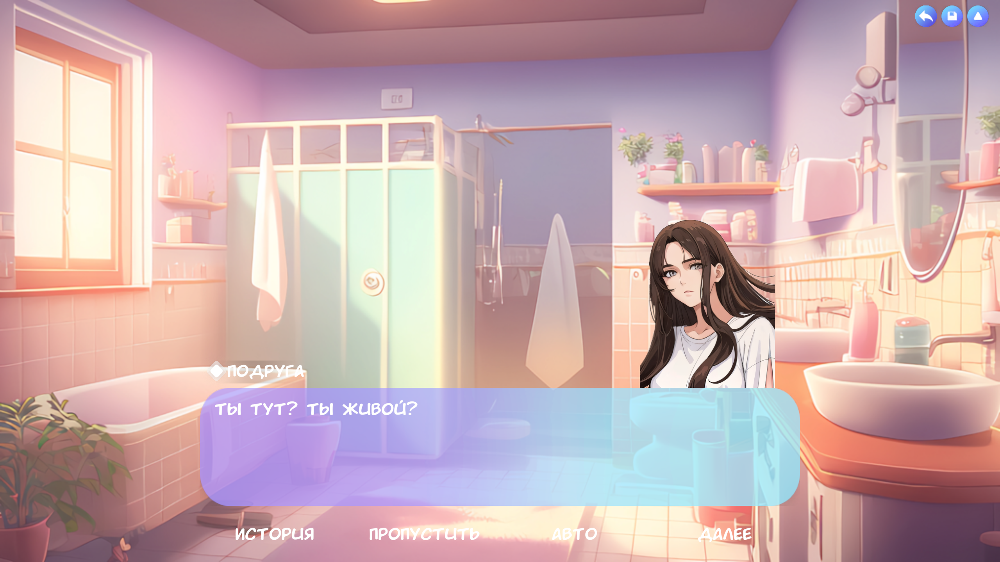
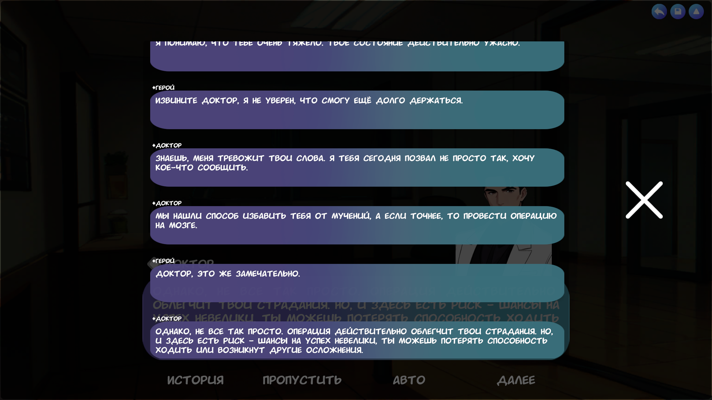

### Скользящая головоломка

Ссылка на проект: <https://github.com/ShutovKS/Sliding-Puzzle>

Игра с двумя режимами: сборка числового пазла и сборка изображения. Включены уровни сложности от 2х2 до 9х9.

* Itch.io - <https://shutovks.itch.io/sliding-puzzle>
* Google Play - <https://play.google.com/store/apps/details?id=com.Forgeofgameworlds.SlidingPuzzle>

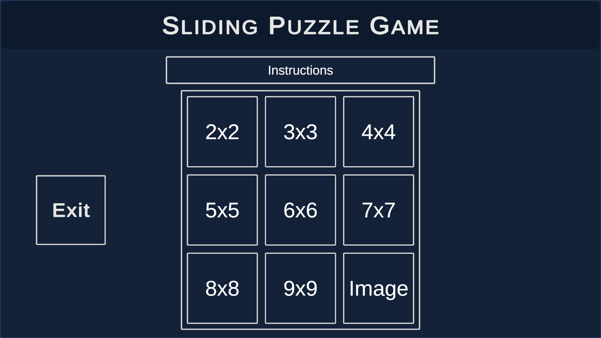
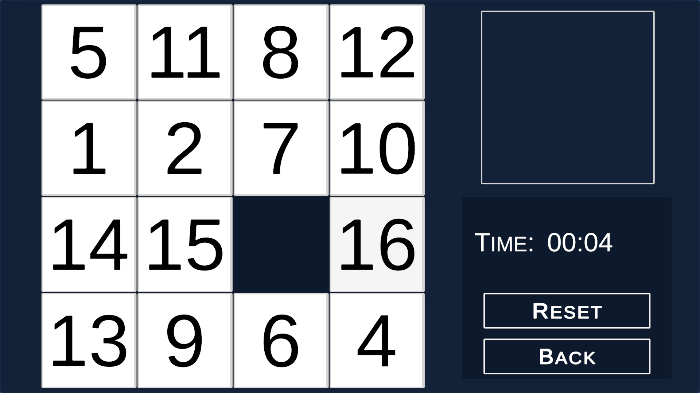
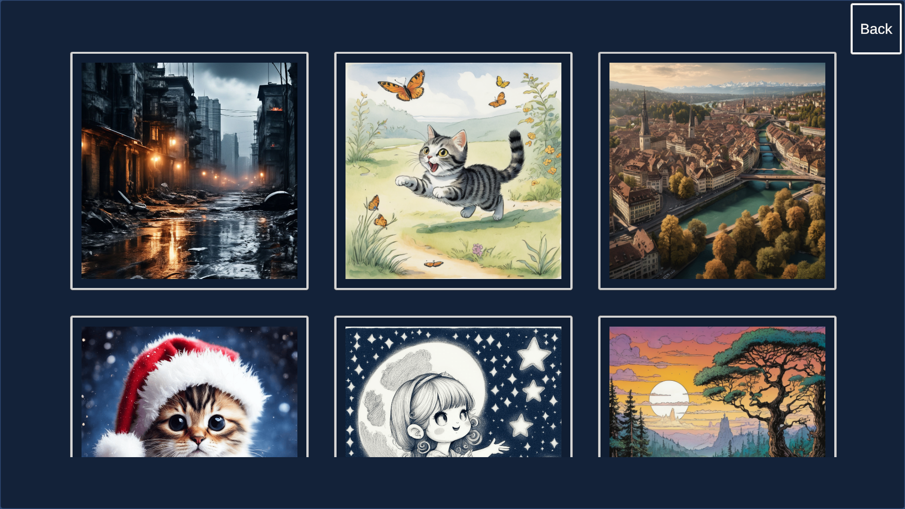
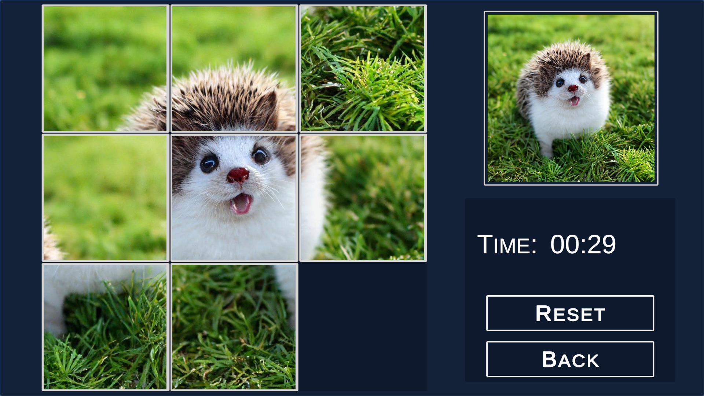

### Американские горки по кладбищу

Ссылка на проект: <https://github.com/ShutovKS/Graveyard-Roller-Coaster>

УУчебный проект для создания VR-аттракциона, где игрок катается на американских горках по кладбищу.

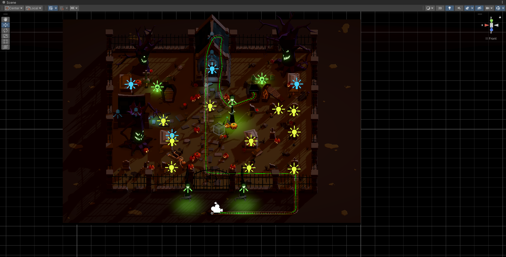
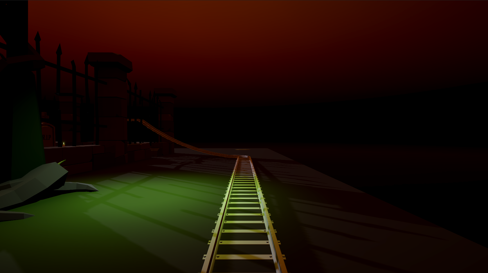
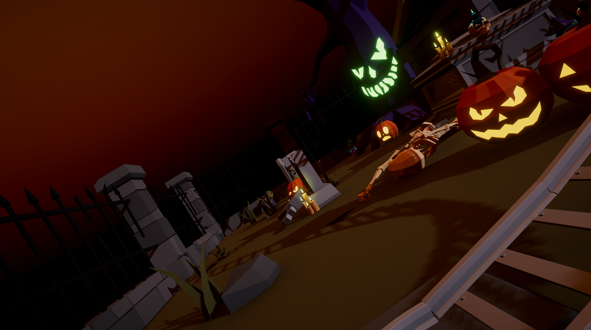
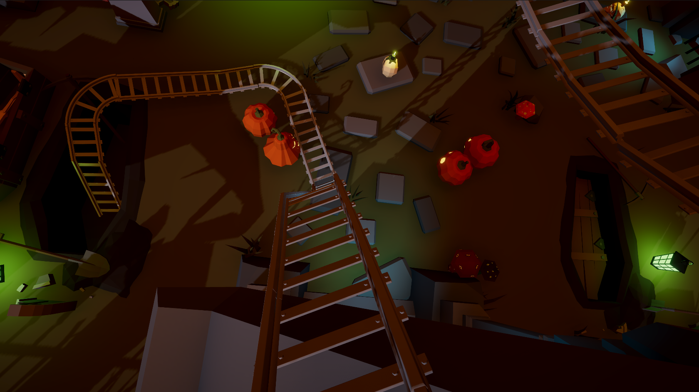

### Менеджер сборок

Ссылка на проект: <https://github.com/ShutovKS/Builds-Manager>

Инструмент для автоматизации создания сборок для различных платформ и управления Scripting Define Symbols.

* Unity Asset Store - <https://assetstore.unity.com/packages/tools/utilities/builds-manager-278887>

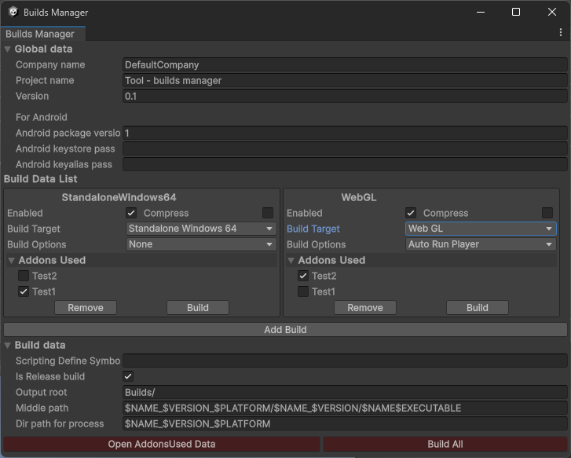

### Захват движения тела и анимирование в Unity

Ссылка на проект: <https://github.com/ShutovKS/Body-motion-capture-and-animation-in-Unity>

Использование Python и OpenCV для захвата движения и передачи данных в Unity для анимирования персонажей.

### Захват движения рук и анимирование в Unity

Ссылка на проект: <https://github.com/ShutovKS/Hand-motion-capture-and-animation-in-Unity>

Использование Python и OpenCV для захвата движения рук и передачи данных в Unity для анимирования персонажей.

### Крестики нолики - HoloLens 2

Ссылка на проект: <https://github.com/ShutovKS/Tic-Tac-Toe-in-MR-for-HoloLens-2>

Приложение для HoloLens 2, демонстрирующее возможности Mixed Reality Toolkit (MRTK). Игра позволяет играть в крестики-нолики в дополненной реальности с использованием Unity Netcode.

### Симуляция магазина

Ссылка на проект: <<https://github.com/ShutovKS/Store-Simulation>

Примитивная симуляция работы магазина с покупателями и кассами. Проект подключен к базе данных для хранения товаров, транзакций и других данных.

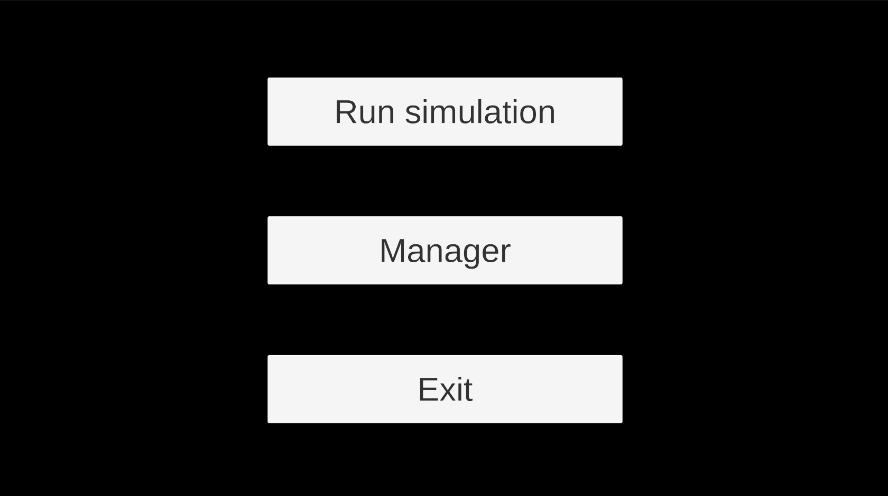
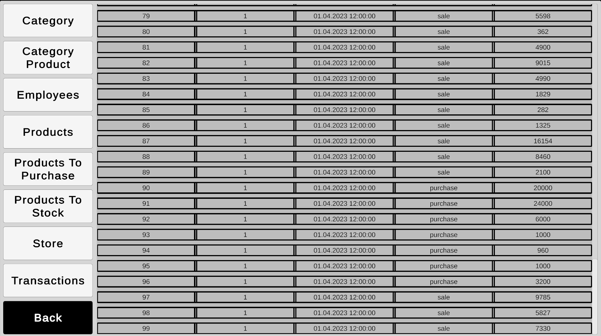
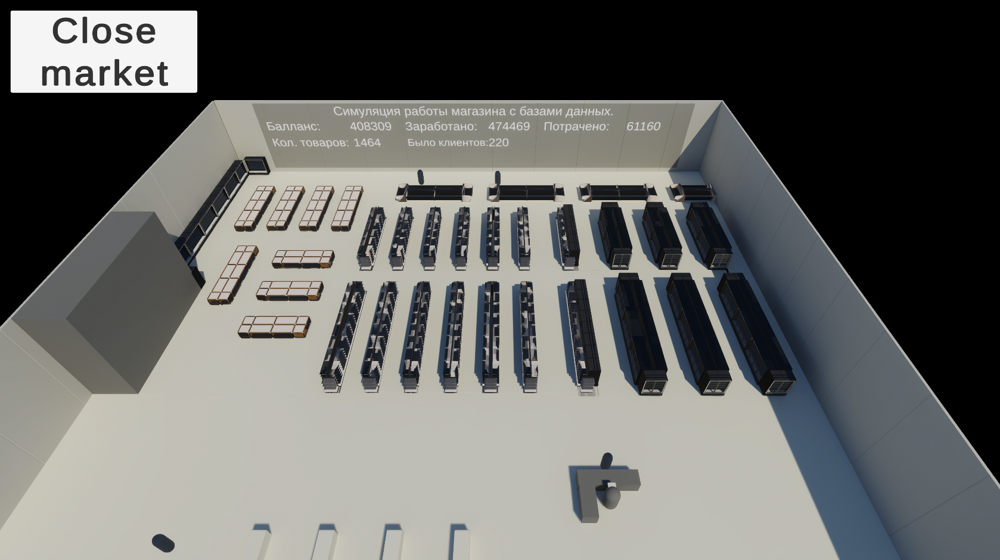
